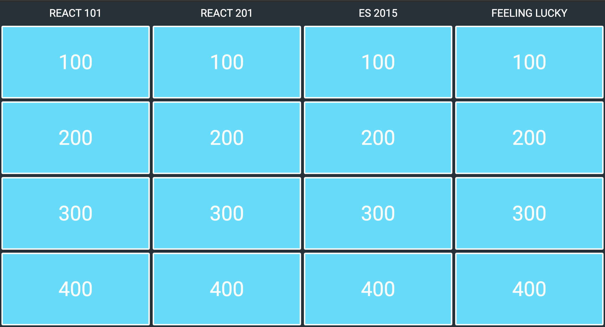

# Trivia
Aplikace na způsob jakési trivia hry.
Ve zkratce se bude jednat o pole (např. 5x4) s kartami. Každý sloupec karet bude spadat do určitého oboru otázek. Horní karty budou mít nejmenší bodovou hodnotu a spodní tu největší (bodová hodnota = obtížnost otázek).

## Princip
 - 2 týmy (hráči)
 - správně odpovězení = bodový zisk
 - po otočení všech karet vyhrává tým (hráč) s větším bodovým ziskem

## Karta
Na kartě bude pravděpodobně zobrazena stanovená bodová hodnota a pod kartou (card-flip) bude otázka s možnými (±4) odpovědmi, kde právě jedna je správná.

## Inspirace

